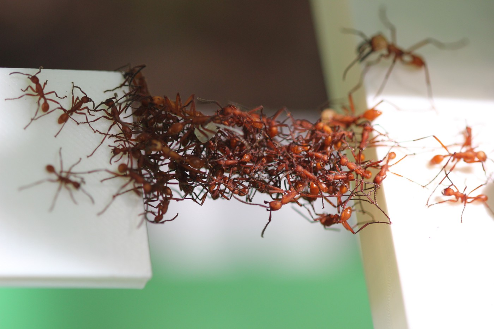

<h2 id="Research">Research Interests</h2>

* **Collective learning**  

* **Swarm robotics** 

* **Synchronization** 

* **Social networks** 

* **Fiedler vector**

<h2 id="Publications">Publications</h2>

<a href="https://scholar.google.com/citations?user=Q6qFeu4AAAAJ&hl=en">Google Scholar</a>   

> Lulu Pan, **Haibin Shao**, Mehran Mesbahi, Yugeng Xi, and Dewei Li.    
>  "**Consensus on Matrix-weighted Switching Networks**"   
>  **IEEE Transactions on Automatic Control** (2021). (To appear)

> **Haibin Shao**, Lulu Pan, Mehran Mesbahi, Yugeng Xi, and Dewei Li.   
>  "**Relative tempo of distributed averaging on networks**"   
>  **Automatica** 105 (2019): 159-166.  

> Lulu Pan, **Haibin Shao**, Mehran Mesbahi, Yugeng Xi, and Dewei Li.   
> "**Bipartite consensus on matrix-valued weighted networks**"   
>  **IEEE Transactions on Circuits and Systems II: Express Briefs** 66, no. 8 (2018): 1441-1445.  

>  Lulu Pan, **Haibin Shao**, Mehran Mesbahi.   
>  "**Laplacian dynamics on signed networks**"   
>  **55th Conference on Decision and Control (CDC)** (2016): 891-896.  

> **Haibin Shao**, Mehran Mesbahi, Dewei Li, and Yugeng Xi.   
> "**Inferring centrality from network snapshots**"   
> **Scientific reports** 7, no. 1 (2017): 1-13.  

<h2 id="Software">Software</h2>
### Neighbor selection

> A matlab code for distributed neighbor selection in multi-agent network using relative tempo amongst adjacent agents. [Download](./codes/neighbor-selection/main.zip)

<h2 id="Contact">Contact</h2>
### Email
shore At sjtu Dot edu Dot cn
### WeChat

