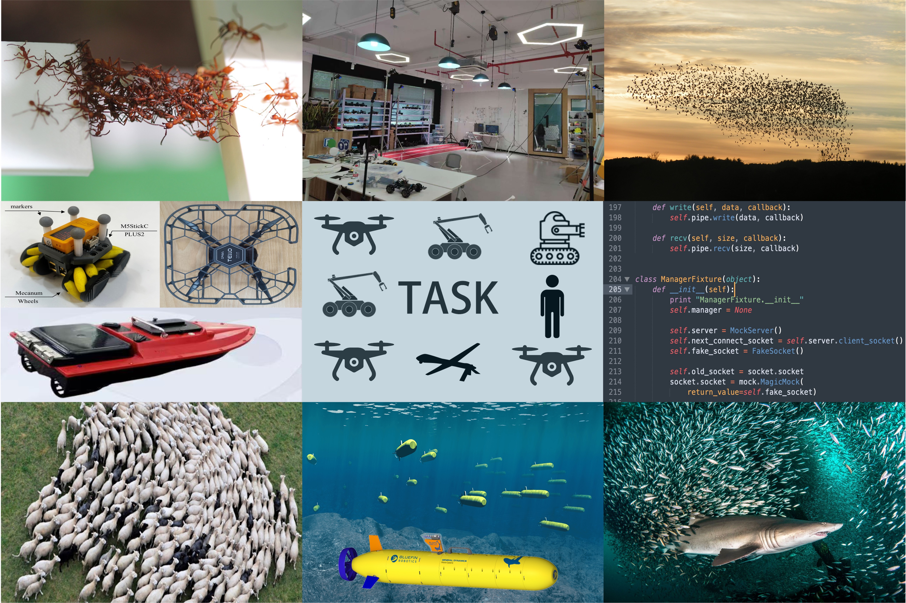

        Haibin Shao (邵海滨), PhD, Professor (Associate)                 
        <a href="http://csc-lab.com/index">复杂系统控制实验室(CSC)</a>                     
        <a href="https://automation.sjtu.edu.cn/haibin">Automation</a> [at] <a href="https://www.sjtu.edu.cn/">Shanghai Jiao Tong University</a>                               
        <a href="https://scholar.google.com/citations?user=Q6qFeu4AAAAJ&hl=en" >[Google Scholar]</a>  <a href="https://www.researchgate.net/profile/Haibin_Shao3" >[ResearchGate]</a>                     
        <a href="mailto:shore@sjtu.edu.cn">Email: shore@sjtu.edu.cn</a>         

## Research ##
I am interested in the **interplay** between **structure** and **dynamics** of **complex systems**. 

In particular, [**swarm intelligence**](https://en.wikipedia.org/wiki/Swarm_intelligence), [**multi-agent systems**](https://en.wikipedia.org/wiki/Multi-agent_system), [**swarm robotics**](https://en.wikipedia.org/wiki/Swarm_robotics) and [**complex networks**](https://en.wikipedia.org/wiki/Complex_network). 

 

## Opening ##
如果你对我的研究方向感兴趣，欢迎联系报考硕士、博士研究生以及申请博士后研究人员。 [more details](/docs/opening)  

  

