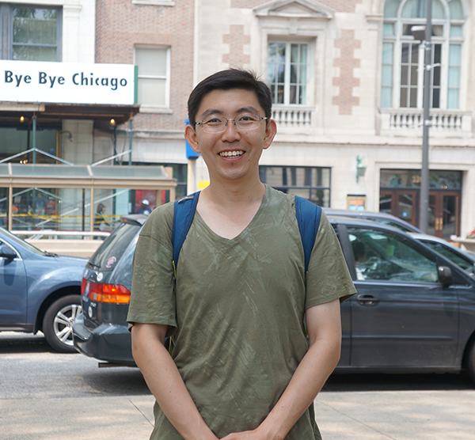

<!--
    
 
         
    
    
-->
                 	
        Haibin Shao (邵海滨), PhD                 
     	Professor (Assistant)  
        <a href="http://csc-lab.com/index">复杂系统控制实验室(CSCL)</a>                     
        <a href="https://automation.sjtu.edu.cn/haibin">Haibin [at] Department of Automation</a>                               
        <a href="https://scholar.google.com/citations?user=Q6qFeu4AAAAJ&hl=en" >[Google Scholar]</a>  <a href="https://www.researchgate.net/profile/Haibin_Shao3" >[ResearchGate]</a>	         
        <a href="https://www.sjtu.edu.cn/">Shanghai Jiao Tong University</a> 
        

## Opening ##
I am looking for Postdoc researchers and PhD students.  [more details](/docs/opening)

## Research ##

Generally, I am interested in the **interplay** between **structure** and **dynamics** of **complex systems**. In particular, **swarm intelligence**, **multi-agent systems**, **complex networks**, **cyber-physical systems** and **autonomous unmanned systems**. [more details](/docs/research)

 

  

